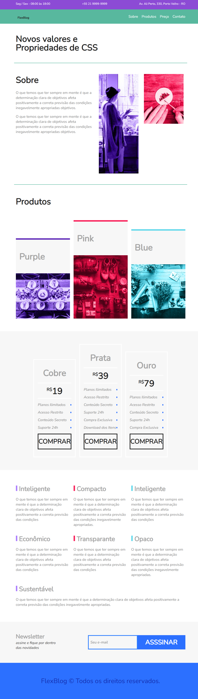

<h1 align="center">
<a href= "https://github.com/EndersonF/site-origamid">🔗 Portólio - Lading page</a>

</h1>

<a href="https://github.com/EndersonF" target="_blank">Autor do projeto</a>

<h3 align="center">🚀 landing page feita para aperfeiçoar conhecimentos em <strong>HTML e CSS</h3></strong>

---

## Tecnologias utilizadas ✅

- HTML
- CSS

---

<h1 align="center"><strong>FlexBlog</h1></strong>

## Estudo desenvolvido pela plataforma [Origamid](https://www.origamid.com/)

## MADE BY: **[Enderson Frazão](https://github.com/EndersonF) 🤟**
